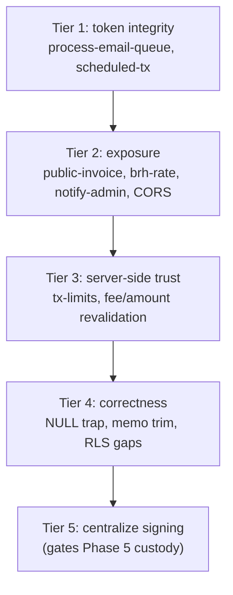

# Security Hardening — Audit Findings & Remediation

A deep review across edge-function auth, JWT/secret handling, RLS, the signing layer, and the frontend. Good news first: the historic `backfill-ledger` forged-JWT hole (called out in [REBUILD.md](REBUILD.md) line 112) is **fixed**, `stellar_secret` is **not** client-SELECTable (column REVOKE + trigger + edge-only reveal), no Stellar seeds are hardcoded, and the payout memo rules (byte-length, uint64, explicit `memoType`) are correctly implemented in [src/pages/Payout.tsx](src/pages/Payout.tsx).

The items below are what remains. Severity reflects real-world exploitability given UUID keys and the gateway `verify_jwt` default.

## Tier 1 — Auth / token integrity (do first)

- **`process-email-queue` trusts an unverified JWT `role` claim.** [supabase/functions/process-email-queue/index.ts](supabase/functions/process-email-queue/index.ts) lines 37-52 (`parseJwtClaims` via `atob`) and 102-112 gate on `claims?.role === 'service_role'`. This is the same forgeable-claim class REBUILD.md warns about; only the gateway `verify_jwt=true` ([supabase/config.toml](supabase/config.toml) line 13) saves it today. Replace with exact match `token === Deno.env.get("SUPABASE_SERVICE_ROLE_KEY")`, mirroring `backfill-ledger` lines 84-100. Drop `parseJwtClaims`.

- **`scheduled-tx` config gap.** It moves real Stellar funds, authenticates only via `x-cron-secret`, but has **no** `config.toml` entry, so it defaults to `verify_jwt=true`. Either cron is silently failing, or it relies on an undeclared deploy config. Confirm the deployed behavior; add an explicit `[functions.scheduled-tx] verify_jwt = false` only alongside a strong, rotated `CRON_SECRET`, and document rotation. Same audit for any other pg_cron-invoked function.

## Tier 2 — Exposure surface

- **`get-public-invoice` is unauthenticated + service-role + `verify_jwt=false`.** [supabase/functions/get-public-invoice/index.ts](supabase/functions/get-public-invoice/index.ts). Mitigated by UUIDv4 ids and it already omits `client_email`, so treat as a capability-URL, not a critical IDOR. Harden: add rate limiting / abuse protection, and ideally move to a revocable, optionally-expiring share token column on `invoices` rather than the raw row id. Confirm no future field additions leak PII.

- **`fetch-brh-rate` writable by any authenticated user.** [supabase/functions/fetch-brh-rate/index.ts](supabase/functions/fetch-brh-rate/index.ts) lets any logged-in user trigger a BRH scrape and write `rate_snapshots` (service role). Rate-poisoning / DoS vector. Gate to admin or cron only; customers read the RLS-protected `rate_snapshots` table.

- **`notify-admin` → `simulate-spih-payment` via raw service key.** [supabase/functions/notify-admin/index.ts](supabase/functions/notify-admin/index.ts) line 41. A leaked `TELEGRAM_WEBHOOK_SECRET` lets an attacker drive a payment-release path. Add an HMAC bound to `order_id`, or call the downstream function with a scoped admin JWT instead of the raw service key.

- **CORS `Access-Control-Allow-Origin: *` on every money/secret endpoint** (`send-payment`, `release-usdc`, `execute-swap`, `withdraw-htgc`, `move-funds`, `reveal-wallet-secret`, `backfill-ledger`, etc.). Introduce a shared CORS helper in `supabase/functions/_shared/` that echoes an allowlisted app origin; keep `*` only for `federation` (SEP-0002, public by design).

## Tier 3 — Server-side trust boundaries

- **Transaction limits enforced in only 4 functions.** `_shared/tx-limits.ts` (`assertWithinLimits`) is imported by `send-payment`, `execute-swap`, `release-usdc`, `admin-refund-distributor` only. `withdraw-htgc`, `execute-withdraw`, `blend-sweep`, `blend-withdraw`, `scheduled-tx`, `htgc-issuance` skip it, and the frontend ([src/pages/Payout.tsx](src/pages/Payout.tsx) lines 346-347) only checks `> 0`. Add `assertWithinLimits` to every fund-moving function (decide intentionally whether internal `move-funds` stays exempt) and add a matching min/max guard in the Payout/Convert UI for UX (server stays authoritative).

- **Confirm server re-validates client-computed amounts/fees/rates.** [src/pages/Convert.tsx](src/pages/Convert.tsx) (lines 337-341 fees, 347/590 limits) and the Payout bank-wire payload (lines 987-1001) compute fees/limits client-side. Verify `create-quote` / `execute-swap` / `send-payment` recompute fees from server-side `fee_bps`/`corridor_bps` and re-check balances against on-chain/DB truth, never trusting the request body. Treat any gap here as a finding.

## Tier 4 — Correctness / hygiene bugs

- **NULL-trap in global search.** [src/components/theo/GlobalSearchBar.tsx](src/components/theo/GlobalSearchBar.tsx) lines 162-168 use `.not("memo","eq",...)` on nullable `payouts.memo`, silently dropping `memo IS NULL` rows (the exact pattern CLAUDE.md warns about). Rewrite with `.or("memo.is.null,memo.neq.<internal>")` semantics.

- **Whitespace memo sent untrimmed.** [src/pages/Payout.tsx](src/pages/Payout.tsx) validates `memo.trim()` (line 361) but sends raw `memo` (line 376). Send the trimmed value and have `send-payment` normalize/reject whitespace-only memos.

- **`chart_of_accounts` RLS unverified.** Enable/policy DDL exists only inside a commented no-op migration, yet live migrations INSERT into it. Verify against the live DB (via Supabase MCP) that RLS is enabled with correct `authenticated`/`service_role` policies; add a migration if missing.

- **Missing explicit `service_role` RLS policies** on `wallets`, `customers`, `orders` (they work via service-role bypass but violate the project convention of declaring both roles). Add explicit policies for consistency and auditability.

## Tier 5 — Architectural (sets up Phase 5)

- **Signing is not centralized.** Only `STELLAR_DISTRIBUTOR_SECRET` lives solely in `_shared/stellar-signer.ts`. Issuer, treasury, and customer-wallet secrets are read via direct `Keypair.fromSecret(...)` in ~18 functions (e.g. `execute-swap` line 445 treasury, `send-payment` lines 130/189, `withdraw-htgc` line 111). This is the single biggest blocker to the KMS+MPC migration ([REBUILD.md](REBUILD.md) Phase 5). Extend `stellar-signer.ts` into a complete signing interface (`signWithIssuer`, `signWithTreasury`, `signWithWallet`) and route every signing call through it, so custody can later be swapped behind one boundary.

## Verification after each tier

Run `npx tsc --noEmit`, `bun run lint`, `bun run test`, then exercise the affected flow on testnet. Finish with the `security-review` skill on the diff (REBUILD.md Phase 4).

## Suggested severity ordering

